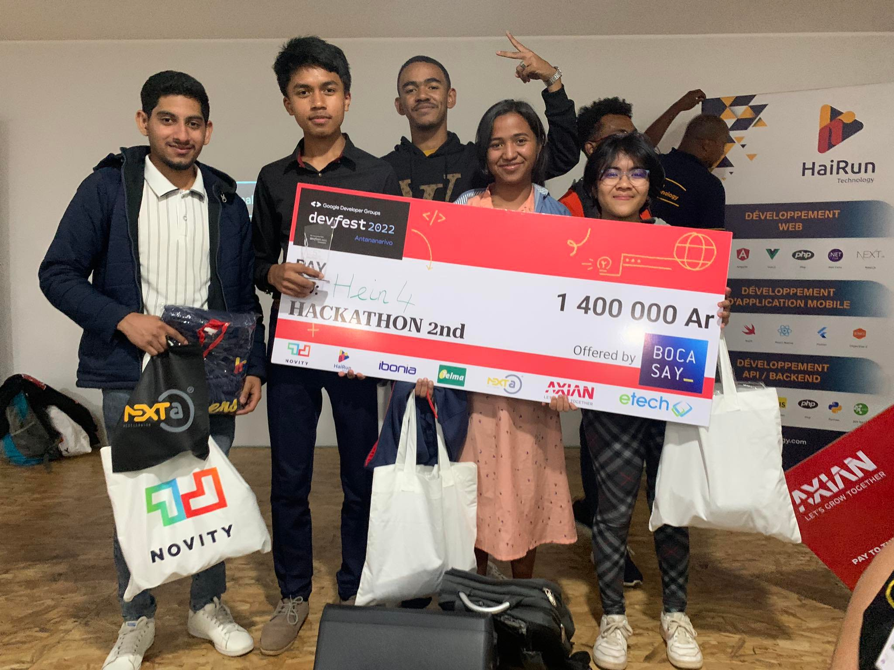

<h1 align=center></h1>

 
  Visitor count 
  

<!--  -->

 

 

<h3 align="center">Languages and Tools:</h3>

  <th>
    
 
  
   
       
    
  

  </th>
  <th>
  

     
   
   
   
   
  
  
   
   
    

  </th>
  <th>
   

     
    
      
     
    

  </th>
  <th>
    

     
   
  
  
</th>
  <th></th>

 
&nbsp;
 

<h1 align=center></h1>

